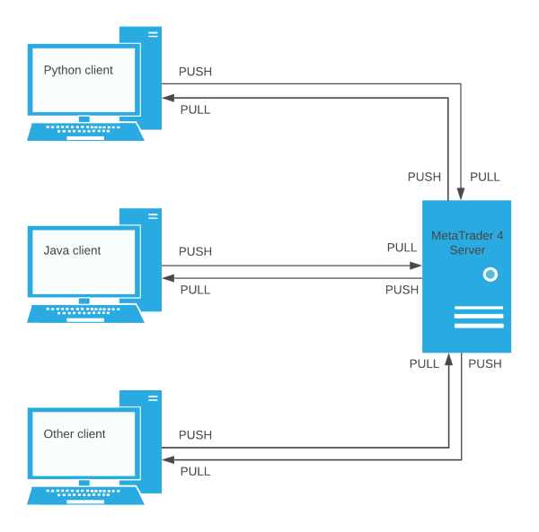

# MetaTrader 4 Server
Provides a remote interface and high-level API for MetaTrader 4 via ZeroMQ sockets.

## Installation
Copy the contents of the [metatrader4](metatrader4) folder into your MetaTrader 4 profile directory, merging the 
folder contents.
Start MetaTrader 4 and add the `ZeroMQ Bridge EA` to any chart (chart symbol does not matter).

## Usage

Typical client request cycle:

  1. Construct an [API](docs/api.md) request.
  1. Send it to the PUSH socket.
  1. Poll the PULL socket until a response is received or an exception is thrown.

It is recommended to use one of the following client libraries to abstract away these details:
- [MetaTrader 4 Python Client](https://github.com/CoeJoder/metatrader4-client-python)
- MetaTrader 4 Java Client (coming soon)

## Development
See [dev docs](docs/dev.md) for details on setting up a local dev environment.
