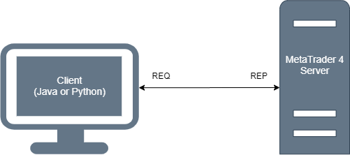

# MetaTrader 4 Server
Provides a remote interface and high-level API for MetaTrader 4 via ZeroMQ sockets.\
See [API](docs/api.md) for supported operations.

## Installation
1. Copy [metatrader4](metatrader4) into your MetaTrader 4 profile directory, merging the 
folder contents.
1. Copy [mql-zmq/Include/](https://github.com/dingmaotu/mql-zmq/tree/f9bf8d94a34194a4fe79ae625779226900fe8657/Include) into the `MQL4/Include` subdirectory of your MetaTrader 4 profile directory, merging the 
folder contents.
1. Copy [mql-zmq/Library/MT4/](https://github.com/dingmaotu/mql-zmq/tree/f9bf8d94a34194a4fe79ae625779226900fe8657/Library/MT4) into the `MQL4/Libraries` subdirectory of your MetaTrader 4 profile directory, merging the 
folder contents.
1. Launch MetaEditor, open `MQL4/Scripts/ZeroMQ_Server.mq4` in your MetaTrader 4 profile directory and compile it.
1. Start MetaTrader 4 and add the `ZeroMQ Server` script to any chart (chart symbol does not matter).  The server begins 
listening for client requests and responds synchronously.

## Configuration
The default listening port is `TCP/28282` but is configurable in the script parameters popup in the MetaTrader terminal,
along with other parameters such as socket timeouts.  If Windows Defender Firewall is running, you must forward the port.

## Usage
Typical client usage:

1. Create a ZeroMQ context and a `REQ` socket with appropriate send/receive timeouts and options.
1. Connect the `REQ` socket to the server's `REP` socket. 
1. Perform the following sequence any number of times:
    1. Construct an [API](docs/api.md) request.
    1. Send the request to the `REQ` socket.
    1. Receive a JSON-formatted string response from the `REQ` socket.
1. Close the socket connection and destroy the ZeroMQ context.

It is recommended to use one of the following client libraries to abstract away these details:
- [Python client](https://github.com/CoeJoder/metatrader4-client-python)
- [Java client](https://github.com/CoeJoder/metatrader4-client-java)

## Limitations
The `REQ-REP` socket connection enforces a strict request-response cycle and may deadlock if connection is lost.
The client libraries use `ZMQ_REQ_RELAXED` and `ZMQ_REQ_CORRELATE` socket options to prevent this in most cases.
If a response is dropped, the client may want to catch the exception and check whether or not the operation was 
successful.

## Development
If you want to make changes to the server implementation, it's useful to setup a [local dev environment](docs/dev.md).
